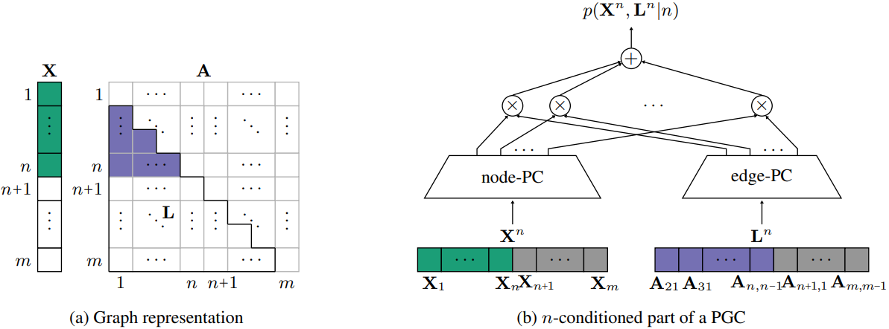

# Probabilistic Graph Circuits (PGCs)

This repository contains the code for the following paper: *Papež M, Rektoris M, Šmídl V, Pevný T. [Probabilistic Graph Circuits: Deep Generative Models for Tractable Probabilistic Inference over Graphs](http://arxiv.org/abs/2503.12162).*

<!--  -->


*An example of a PGC for undirected acyclic graphs.* (a) We consider a graph $`\mathbf{G}`$ represented by a feature matrix, $`\mathbf{X}`$, and an adjacency tensor, $`\mathbf{A}`$, such that each instance of $`\mathbf{G}`$ (highlighted in green and blue) has a random number of nodes, $`n\in(0,1,\ldots,m)`$, where $`m`$ is a fixed maximum number of nodes. The empty places (white) are not included in the training data. (b) The main building block of PGCs is the $`n`$-conditioned joint distribution over $`\mathbf{X}^n`$ and $`\mathbf{L}^n`$, the latter of which is a flattened lower triangular part of $`\mathbf{A}^n`$. $`\mathbf{X}^n`$ and $`\mathbf{L}^n`$ are used as input into the node-PC and edge-PC, respectively. The empty places are marginalized out (grey). The outputs of these two PCs are passed through the product layer with $`n_c`$ units and the sum layer with a single unit.

```
@inproceedings{papez2025probabilistic,
 title={Probabilistic Graph Circuits: Deep Generative Models for Tractable Probabilistic Inference over Graphs},
 author={Milan Pape\v{z} and Martin Rektoris and V\'{a}clav \v{S}m\'{i}dl and Tom\'{a}\v{s} Pevn\'{y}},
 booktitle={},
 year={2025},
 url={}
}
```

## 1. Install

Clone this repository.
```
git clone https://github.com/mlnpapez/PGC PGC
```

Go to the PGCs directory.
```
cd PGC
```

Set up the environment.
```
conda create --name pgc python=3.10

conda activate pgc

pip install torch==2.5.1 --index-url https://download.pytorch.org/whl/cu124
pip install rdkit==2024.3.6
pip install tqdm==4.67.0
pip install pandas==2.2.3
pip install pylatex==1.4.2
pip install scipy==1.14.1
pip install fcd_torch==1.0.7
pip install scikit-learn==1.6.0
pip install git+https://github.com/fabriziocosta/EDeN.git
```

## 2. Preprocess
The following command will download and preprocess the QM9 or Zinc250k dataset, each for five different orderings.
```
python -m utils.datasets
```
For example, the script will produce `qm9_canonical.pt`, which contains molecules in the canonical ordering of the atoms. To select the dataset, change `dataset` in `utils.datasets.py`.

## 3. Train
`config/qm9/` contains JSON files with the hyper-parameters of different PGC variants. Change the hyper-parameters based on your preferences and then run the following command.
```
python -m train
```
It will train all the PGC variants (or only the selected ones if you change the list of `names` in `train.py`).

The resulting models will be stored in `results/training/model_checkpoint/`, and the corresponding illustrations of unconditional molecule generation, along with the metrics assessing the performance of the models, will be stored in `results/training/model_evaluation/`.


*Unconditional samples of molecular graphs from the PT-S variant of PGCs (`pgc_marg`).*

## 4. Gridsearch
`gridsearch_hyperpars.py` contains hyper-parameter grids for finding suitable architectures of the PGCs variants. Change the hyper-parameter grids based on your preferences, and then run the following command.
```
nohup python -m gridsearch > gridsearch.log &
```
This command will run the script in the background, submitting jobs to your SLURM cluster. The resulting models, metrics, and output logs will be stored in `results/gridsearch/model_checkpoint/`, `results/gridsearch/model_evaluation/`, and `results/gridsearch/model_outputlogs/`, respectively.

After completing all the SLURM jobs, run the following command.
```
python -m gridsearch_evaluate
```
It will produce a table comparing the PGC variants with the baselines (both in the `.pdf` and `.tex` formats).

## 4. Conditional Molecule Generation
Run the following command to generate new molecules conditionally on a known molecule.
```
python -m conditional_sampling
```
To impose a known structure of the generated molecules, change `patt_smls` in `conditional_sampling.py`. Similarly, to select a model from which to generate the samples, change `model_path`.


*Conditional samples of molecular graphs from the PT-S variant of PGCs (`pgc_marg`). The known part of a molecule is highlighted in blue.*
