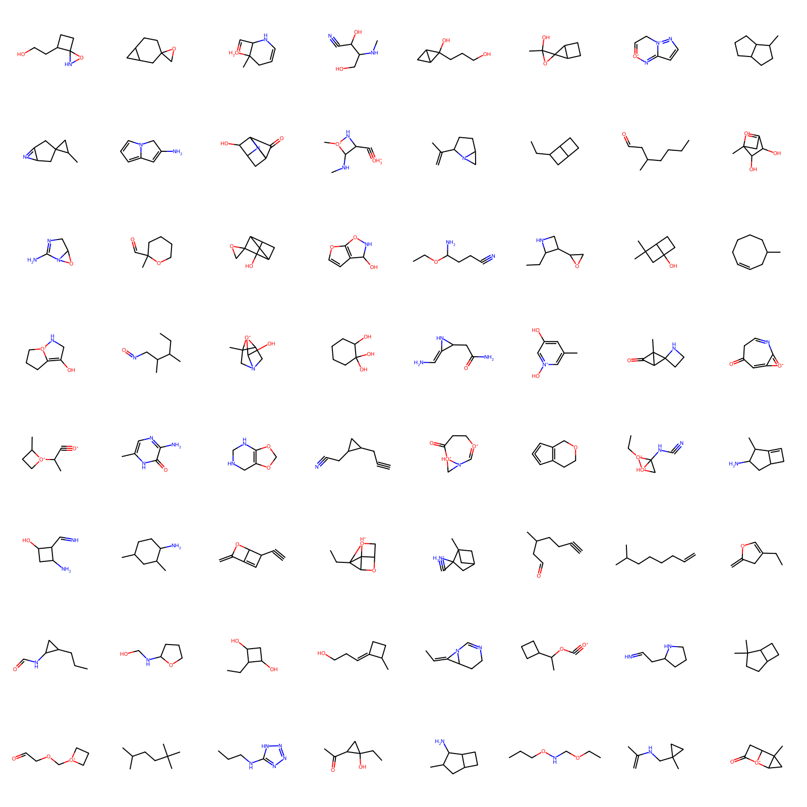
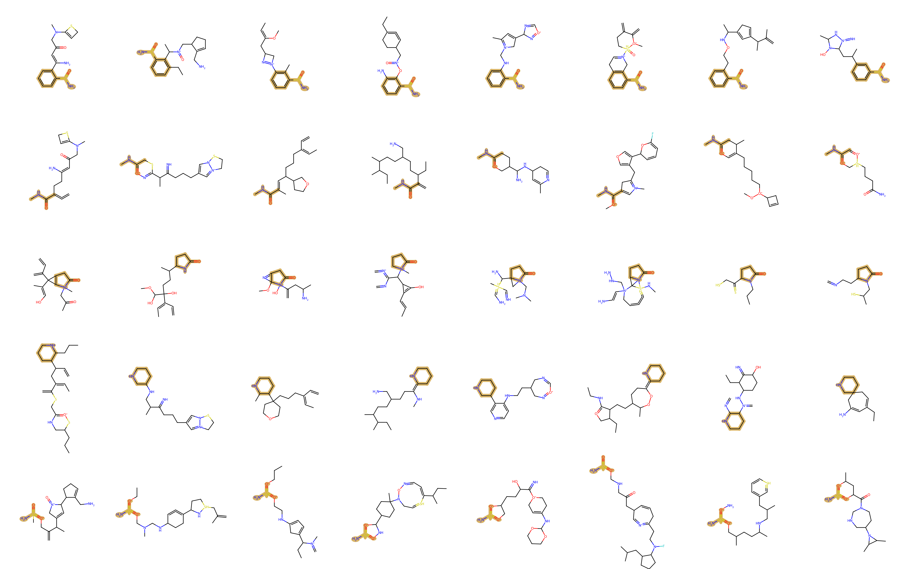

# Molecular Sum-Product Networks (MolSPNs)


## 1. Install

Clone this repository.
```
git clone https://github.com/mlnpapez/MolSPN MolSPN
```

Go to the MolSPN directory.
```
cd MolSPN
```

Set up the environment.
```
conda create --name molspn python==3.8.5

source activate molspn

pip install torch==2.1.2 --index-url https://download.pytorch.org/whl/cu121
pip install rdkit==2022.9.5
pip install tqdm==4.65.0
pip install pandas==2.0.3
pip install pylatex==1.4.2
```

## 2. Preprocess
The following command will download and preprocess two versions of the QM9 dataset. `qm9_sort.pt` contains molecules with the canonical ordering of the atoms. `qm9_perm.pt` contains molecules with a random ordering of the atoms.
```
python -m utils.datasets
```
## 3. Train
`config/qm9/` contains JSON files with the MolSPN variants' hyper-parameters. Change the hyper-parameters based on your preferences and then run the following command.
```
python -m train
```
It will train all the MolSPN variants (or only the selected ones if you change the list of `names` in `train.py`).

The resulting models will be stored in `results/training/model_checkpoint/`, and the corresponding illustrations of unconditional molecule generation, along with the metrics assessing the performance of the models, will be stored in `results/training/model_evaluation/`.



*Unconditional samples of molecular graphs from the sort variant of MolSPNs (`molspn_zero_sort`).*

## 4. Gridsearch
`gridsearch_hyperpars.py` contains hyper-parameter grids to find a suitable architecture for the MolSPN variants. Change the hyper-parameter grids based on your preferences, and then run the following command.
```
nohup python -m gridsearch > gridsearch.log &
```
This command will run the script in the background, submitting jobs to your SLURM cluster. The resulting models, metrics, and output logs will be stored in `results/gridsearch/model_checkpoint/`, `results/gridsearch/model_evaluation/`, and `results/gridsearch/model_outputlogs/`, respectively.

To reproduce the results in the paper (Table 1), keep the current settings in `gridsearch_hyperpars.py`. Then, after completing all the SLURM jobs, run the following command.
```
python -m gridsearch_evaluate
```
It will produce Table 1 from the paper (both in the `.pdf` and `.tex` formats).

## 4. Conditional Molecule Generation
Run the following command to generate new molecules conditionally on a known molecule.
```
python -m conditional_sampling
```
To impose a known structure of the generated molecules, change `patt_smls` in `conditional_sampling.py`. Similarly, to select a model from which to generate the samples, change `model_path`.



*Conditional samples of molecular graphs from the sort variant of MolSPNs (`molspn_zero_sort`). The known part of a molecule is highlighted in blue.*
